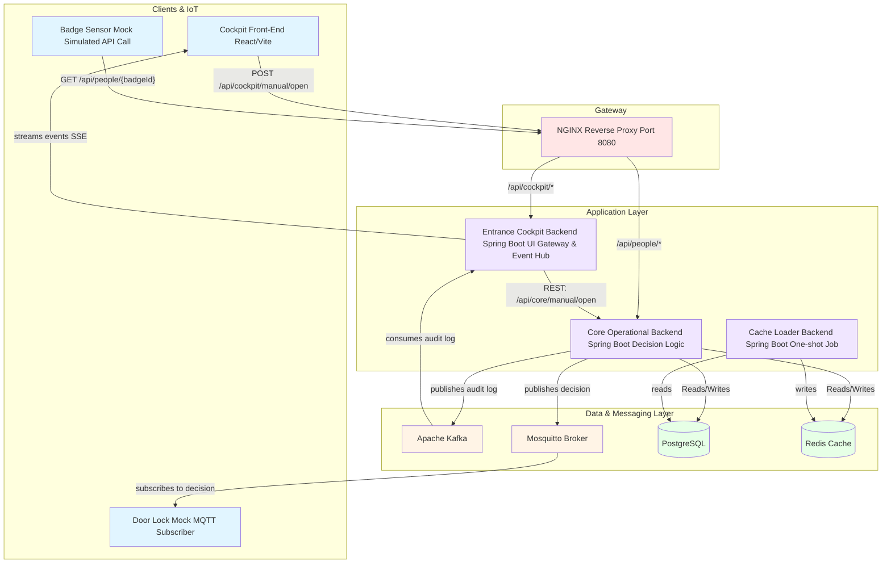

# Badge Entrance Simulation — Roadmap

A DevOps- and infra-focused simulation of a company entrance system. Employees “scan” a badge; backend microservices validate, authorize, log, and signal a (mock) door lock. No embedded work—only software simulation and service integration.

---

## 🧱 Architecture (high level)




### Components

**Clients & IoT (simulated)**
- *Entrance Cockpit (Web UI)* — Real-time dashboard served by NGINX; sends manual commands to the cockpit backend.
- *Door Lock (Mock MQTT client)* — Subscribes to authorization decisions on an MQTT topic.
- *Badge Sensor (Simulated via curl/Postman)* — Triggers the core logic by making a REST API call.

**Gateway**
- *NGINX* — Reverse proxy routing UI and API requests to the correct backend services.

**Microservices (Dockerized)**
- *core-operational-backend (Spring Boot)* — **The Brain.** Validates badges against Redis/PostgreSQL; publishes decisions to MQTT and audit logs to Kafka. Exposes the core decision-making and manual override endpoints.
- *entrance-cockpit-backend (Spring Boot)* — **The UI Gateway.** Consumes Kafka logs, streams them to the UI via Server-Sent Events (SSE), and provides the API for manual overrides from the UI.
- *cache-loader-backend (Spring Boot)* — **One-shot Job.** Runs on startup (or periodically) to populate the Redis cache from PostgreSQL.

**Data & Messaging**
- *PostgreSQL* — The source of truth for registered people and their status.
- *Redis* — A hot cache of registered people for fast lookups.
- *Kafka* — A durable log for all access events (`access-events`) and manual overrides (`manual-override-events`).
- *MQTT broker (Mosquitto)* — A lightweight broker for real-time IoT communication (`iot/entrance/decision`).

---

## 🔄 End-to-End Data Flow

1. **Badge Scan (Simulation)** → An external client calls `GET /api/people/{badgeId}` via NGINX, which routes to the **Core Operational Backend**.
2. **Decision** → The Core Backend checks **Redis** for the badge, with a fallback to **PostgreSQL**. It makes an authorize/deny decision.
3. **IoT Command** → The Core Backend publishes the decision (`GRANTED`/`DENIED`) to the `iot/entrance/decision` MQTT topic. The **Door Lock Mock** reacts.
4. **Audit Log** → The Core Backend also publishes a detailed event to the `access-events` Kafka topic.
5. **UI Update** → The **Entrance Cockpit Backend**, which is subscribed to the Kafka topic, receives the event and pushes it to all connected **Web UI** clients via SSE.
6. **Cache Loading** → On startup, the **Cache Loader Backend** reads from PostgreSQL and populates the Redis cache.

---

## 🧰 Tech Stack

- **Runtime:** Spring Boot (Java 21), Node.js (for IoT mocks)
- **Frontend:** Vite, React, TypeScript
- **Infra (local):** Docker Compose, NGINX, Redis, PostgreSQL, Kafka (+ ZooKeeper), Mosquitto
- **Build:** Maven, npm
- **CI/CD (Future):** GitHub Actions or GitLab CI
- **Observability (Future):** Prometheus, Grafana, Loki

---

## 📁 Repository Structure
```
/
├── app/
│   ├── services/
│   │   ├── core-operational-backend/    (Spring Boot)
│   │   ├── entrance-cockpit-backend/    (Spring Boot)
│   │   └── cache-loader-backend/        (Spring Boot)
│   ├── iot/
│   │   └── door-lock-mock/              (Node.js)
│   └── web/
│       └── entrance-cockpit-front/      (Vite/React)
├── deploy/
│   └── compose/
│       ├── docker-compose.all.yml
│       └── .env
├── nginx/
│   └── nginx.conf
├── kafka/
├── postgres/
│   └── init.sql
├── mosquitto/
│   └── config/
│       └── mosquitto.conf
└── docs/
    └── README.md
```

## 🗺️ Phased Roadmap

### Phase 1 — Foundation ✅ (Complete)

- Repo layout created.
- Base Dockerfiles and Docker Compose file for all infrastructure (Postgres, Redis, Kafka, Mosquitto, NGINX).
- Health checks confirm all containers are up.

### Phase 2 — Core Logic ✅ (Complete)

- Spring Boot services for **core-operational**, **cockpit-backend**, and **cache-loader** are implemented.
- **Cache Loader** successfully syncs PostgreSQL → Redis.
- **Core Backend** implements Redis-first badge validation with a PostgreSQL fallback.
- **Core Backend** publishes decisions to MQTT and audit logs to Kafka.

### Phase 3 — UI & Integration ✅ (Complete)

- Vite/React UI is created and served via NGINX.
- **Cockpit Backend** consumes Kafka events and streams them to the UI via SSE.
- The full manual override flow (UI → Cockpit Backend → Core Backend → MQTT/Kafka) is implemented and working.

### Phase 4 — Hardening & Observability 🔜 (Future)

- Add Prometheus/Grafana for monitoring service metrics and Kafka lag.
- Implement robust secrets handling (e.g., Docker secrets).
- Add integration tests using Testcontainers.
- Set up a CI/CD pipeline using GitHub Actions to build and test on every commit.

---

## ✅ Acceptance Criteria (Met)

- A badge scan (`curl`) results in:
    - **(a)** an `OPEN` or `DENY` message in the `door-lock-mock` log.
    - **(b)** an event published to the `access-events` Kafka topic.
    - **(c)** a real-time update in the Cockpit UI's "Live Stream".
- A manual override from the cockpit UI immediately triggers the door lock and a UI update.
- The cache loader successfully populates the Redis cache on startup.
- The entire stack starts cleanly with `docker compose up -d --build`.

## ▶️ Quickstart
```bash
# 1. Start the entire application stack in the background
# The --build flag is only needed on the first run or after code changes.
docker compose -f deploy/compose/docker-compose.all.yml up -d --build

# 2. (One-time) Run the cache loader to populate Redis
docker compose -f deploy/compose/docker-compose.all.yml up cache-loader-backend

# 3. Open the Cockpit UI in your browser
# (Give the services ~30 seconds to fully initialize)
open http://localhost:8080/cockpit/

# 4. Tail the logs of all services
docker compose -f deploy/compose/docker-compose.all.yml logs -f

# 5. Simulate a badge scan (in a new terminal)
curl http://localhost:8080/api/people/B-0001
```

## 🔍 Monitoring & Debugging

### Check Service Health
```bash
# View all running containers
docker compose -f deploy/compose/docker-compose.all.yml ps

# Check logs for a specific service
docker compose -f deploy/compose/docker-compose.all.yml logs -f core-operational-backend
```
### Verify Data Flow
```bash
# Check Redis cache contents
docker exec -it redis redis-cli
> KEYS *
> GET person:B-0001

# Check PostgreSQL data
docker exec -it postgres psql -U entrance_user -d entrance_db
> SELECT * FROM people;

# Monitor Kafka topics
docker exec -it kafka kafka-console-consumer.sh \
  --bootstrap-server localhost:9092 \
  --topic access-events \
  --from-beginning
```
### MQTT Testing
```bash
# Subscribe to door decisions
docker exec -it mosquitto mosquitto_sub -t "iot/entrance/decision"
```

## 🛠️ Development

### Rebuild a Single Service
```bash
docker compose -f deploy/compose/docker-compose.all.yml up -d --build core-operational-backend
```

### Stop All Services

bash

```bash
docker compose -f deploy/compose/docker-compose.all.yml down
```

### Clean Up (Remove volumes)

bash

```bash
docker compose -f deploy/compose/docker-compose.all.yml down -v
```

---

## 📝 API Endpoints

### Core Operational Backend

- `GET /api/people/{badgeId}` — Validate badge and trigger entrance flow
- `POST /api/core/manual/open` — Manual override to open door

### Entrance Cockpit Backend

- `GET /api/cockpit/events/stream` — SSE endpoint for real-time events
- `POST /api/cockpit/manual/open` — Manual override from UI

---

## 🚀 Future Enhancements

- **Multi-entrance support** — Scale to multiple doors with different access policies
- **Advanced analytics** — Track peak usage times, denied access patterns
- **Role-based access** — Different badge types with different permissions
- **Visitor management** — Temporary badges with expiration
- **Integration tests** — Comprehensive test suite with Testcontainers
- **Performance testing** — Load testing with JMeter or Gatling