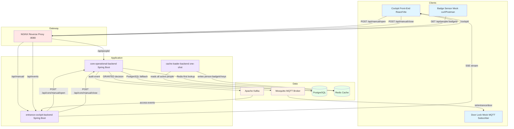

# IoT Access Control Simulation

A DevOps- and infra-focused simulation of a company entrance system. Employees "scan" a badge; backend microservices validate, authorize, log, and signal a (mock) door lock. No embedded work — only software simulation and service integration.

---

## Architecture



### Components

**Clients & IoT (simulated)**
- *Entrance Cockpit (Web UI)* — React/Vite dashboard served via NGINX. Shows a live event stream and sends manual door commands.
- *Door Lock Mock (Node.js)* — Subscribes to the `iot/entrance/door` MQTT topic and reacts to decisions.
- *Badge Sensor* — Simulated with `curl` or Postman hitting `GET /api/people/{badgeId}`.

**Gateway**
- *NGINX* — Single entry point on port `8080`. Routes `/api/people/*` to the core backend, `/api/manual/*` and `/api/events` to the cockpit backend, `/cockpit/` to the frontend.

**Microservices**
- *core-operational-backend* — **The brain.** Redis-first badge lookup (PostgreSQL fallback), GRANTED/DENIED decision, publishes MQTT command and Kafka audit event.
- *entrance-cockpit-backend* — **The UI hub.** Consumes the Kafka `access-events` topic and pushes events to the browser via SSE. Proxies manual door commands to the core backend.
- *cache-loader-backend* — **One-shot job.** Reads all active people from PostgreSQL on startup and writes them to Redis (`person:{badgeId}` keys), then exits.
- *shared-model* — Maven library with the JPA `Person` entity, depended on by both `core-operational-backend` and `cache-loader-backend` so they (de)serialize the same class through Redis.

**Data & Messaging**
- *PostgreSQL* — Source of truth. Table: `registered_people`.
- *Redis* — Hot cache for fast badge lookups. Keys: `person:{badgeId}`. Values: JSON, no class metadata.
- *Kafka* — Durable audit log. Topic: `access-events` (badge scans and manual overrides).
- *Mosquitto* — Lightweight MQTT broker. Topic: `iot/entrance/door`.

---

## End-to-End Data Flow

1. **Badge scan** — `GET /api/people/{badgeId}` reaches `core-operational-backend` via NGINX.
2. **Cache lookup** — Core checks Redis for `person:{badgeId}`. On miss, falls back to PostgreSQL and writes the result back to Redis.
3. **Decision** — If the person exists and `is_active = true`, access is `GRANTED`; otherwise `DENIED`.
4. **MQTT command** — On `GRANTED`, core publishes `{badgeId, fullName, status, eventType, timestamp}` to `iot/entrance/door`. The door-lock mock reacts.
5. **Kafka audit** — Core publishes the same shape of event to `access-events` (granted *and* denied).
6. **SSE push** — `entrance-cockpit-backend` consumes the Kafka event and pushes it to all connected browser clients via SSE.
7. **Cache bootstrap** — On startup, `cache-loader-backend` pre-populates Redis from PostgreSQL so the first scan is always a cache hit.

---

## Tech Stack

| Layer | Technology |
|---|---|
| Backend services | Spring Boot 3.5 (Java 21), Maven multi-module |
| IoT mock | Node.js, MQTT.js |
| Frontend | Vite, React, TypeScript, Tailwind CSS, shadcn-ui |
| Messaging | Apache Kafka + ZooKeeper, Mosquitto (MQTT) |
| Data | PostgreSQL 15, Redis 7 |
| Gateway | NGINX (alpine) |
| Container | Docker, Docker Compose |
| CI/CD | GitHub Actions (planned) |
| Observability | Prometheus + Grafana + Loki (planned) |

---

## Repository Structure

```
/
├── app/
│   ├── services/
│   │   ├── pom.xml                       (Maven aggregator parent)
│   │   ├── shared-model/                 (JPA Person entity reused by core + cache-loader)
│   │   ├── core-operational-backend/     (Spring Boot — decision engine)
│   │   ├── cache-loader-backend/         (Spring Boot — one-shot Redis loader)
│   │   ├── entrance-cockpit-backend/     (Spring Boot — SSE hub & manual control)
│   │   └── iot/
│   │       └── door-lock-mock/           (Node.js — MQTT subscriber)
│   └── web/
│       └── entrance-cockpit-front/       (Vite/React — operator dashboard)
├── deploy/
│   ├── compose/
│   │   ├── docker-compose.all.yml        (single-host full stack)
│   │   └── .env.example                  (template — copy to .env)
│   ├── nginx/conf.d/nginx.conf
│   ├── postgres/init.sql
│   ├── mosquitto/config/mosquitto.conf
│   └── kafka/topics-init.sh
└── docs/
    └── ROADMAP.md
```

---

## Quickstart

```bash
# 1. Copy and fill in the env file
cp deploy/compose/.env.example deploy/compose/.env
# Edit POSTGRES_USER, POSTGRES_PASSWORD, POSTGRES_DB

# 2. Start the full stack (first run builds images)
docker compose -f deploy/compose/docker-compose.all.yml up -d --build

# 3. Open the Cockpit UI — give services ~30s to initialize
#    macOS:   open http://localhost:8080/cockpit/
#    Linux:   xdg-open http://localhost:8080/cockpit/
#    Windows: start http://localhost:8080/cockpit/

# 4. Simulate a badge scan
curl http://localhost:8080/api/people/B-0001

# 5. Tail logs
docker compose -f deploy/compose/docker-compose.all.yml logs -f
```

Kafka auto-creates the `access-events` topic, but you can also create it explicitly:

```bash
docker exec badge-kafka bash /topics-init.sh
```

---

## API Endpoints

### Core Operational Backend (port 8081, via NGINX on 8080)

| Method | Path | Description |
|---|---|---|
| `GET` | `/api/people/{badgeId}` | Badge scan — validate and trigger the full event flow |
| `POST` | `/api/core/manual/open` | Manual door open (called by cockpit backend) |
| `POST` | `/api/core/manual/close` | Manual door close (called by cockpit backend) |
| `GET` | `/status` | Health check — returns service instance ID |

### Entrance Cockpit Backend (port 8082, via NGINX on 8080)

| Method | Path | Description |
|---|---|---|
| `GET` | `/api/events` | SSE stream — real-time access events pushed to the browser |
| `POST` | `/api/manual/open` | Manual door open from the UI |
| `POST` | `/api/manual/close` | Manual door close from the UI |

---

## Monitoring & Debugging

### Service Health

```bash
# All containers and their status
docker compose -f deploy/compose/docker-compose.all.yml ps

# Logs for a specific service
docker compose -f deploy/compose/docker-compose.all.yml logs -f core-operational-backend
```

### Verify Data

```bash
# Redis — check cached people
docker exec -it badge-redis redis-cli KEYS "person:*"
docker exec -it badge-redis redis-cli GET "person:B-0001"

# PostgreSQL — check source data
docker exec -it badge-postgres psql -U "$POSTGRES_USER" -d "$POSTGRES_DB" \
  -c "SELECT badge_id, full_name, role, is_active FROM registered_people;"

# Kafka — consume events from the beginning
docker exec -it badge-kafka kafka-console-consumer \
  --bootstrap-server kafka:9092 \
  --topic access-events \
  --from-beginning

# MQTT — subscribe to door decisions
docker exec -it badge-mosquitto mosquitto_sub -t "iot/entrance/door"
```

---

## Development

### Rebuild a Single Service

```bash
docker compose -f deploy/compose/docker-compose.all.yml up -d --build core-operational-backend
```

### Stop All Services

```bash
docker compose -f deploy/compose/docker-compose.all.yml down
```

### Clean Up (including volumes)

```bash
docker compose -f deploy/compose/docker-compose.all.yml down -v
```

### Local Maven build (without Docker)

```bash
cd app/services
mvn -pl core-operational-backend -am package
mvn -pl cache-loader-backend -am package
cd entrance-cockpit-backend && ./mvnw package
```

---

## Phased Roadmap

### Phase 1 — Foundation (Done)
Infrastructure scaffold: Dockerfiles, Docker Compose, health checks for all infra services.

### Phase 2 — Core Logic (Done)
Spring Boot services implemented, Kafka/MQTT/Redis/PostgreSQL wired up.

### Phase 3 — UI & Integration (Done)
Vite/React cockpit, SSE stream, manual override flow end-to-end.

### Phase 4 — Refactoring & Bug Fixes (Done)
- Person entity aligned with DB schema; badge scan controller added.
- Kafka topic mismatch fixed; `AccessEventDTO` aligned with producer payload.
- Redis-first lookup implemented in `PersonService`.
- `cache-loader-backend` fully implemented.
- CORS, global exception handler, `.env.example` added.
- `ObjectMapper` replacing `String.format()` JSON across all services.
- Deploy folder consolidated to `docker-compose.all.yml` only; all health checks correct.

### Phase 5 — Reliability fixes (Done)
- MQTT door-lock contract fixed: payload now includes `status`, key names match the door-lock mock.
- Shared `Person` entity extracted to a Maven module; Redis serialization no longer ties values to a service-specific FQN.
- `spring-boot-devtools` removed from production images.
- `restart: unless-stopped` added to long-running services.
- Stranded services (watchdog, telemetry, badging-mock) deleted; README reflects the actual stack.
- `.env` files untracked; broader `.gitignore`.

### Phase 6 — Hardening & Observability (Next)
- Add `spring-boot-starter-actuator` + Prometheus endpoint to all Spring Boot services.
- Add Grafana dashboard: Kafka consumer lag, Redis hit/miss rate, HTTP latency.
- Add Loki for log aggregation.
- Replace plain-text `.env` credentials with Docker secrets.
- Add integration tests with Testcontainers.
- Set up GitHub Actions CI: build → test → push Docker image.

### Phase 7 — Future Enhancements
- Multi-entrance support (topic per door, per-door access policies).
- Role-based access (badge type → allowed doors).
- Visitor badges (temporary IDs with Redis TTL expiry).
- Badge scan simulator (automated traffic generator).
- Advanced analytics (peak hours, denial patterns, per-person history).

---

> Full technical audit and task tracking: [docs/ROADMAP.md](docs/ROADMAP.md)
