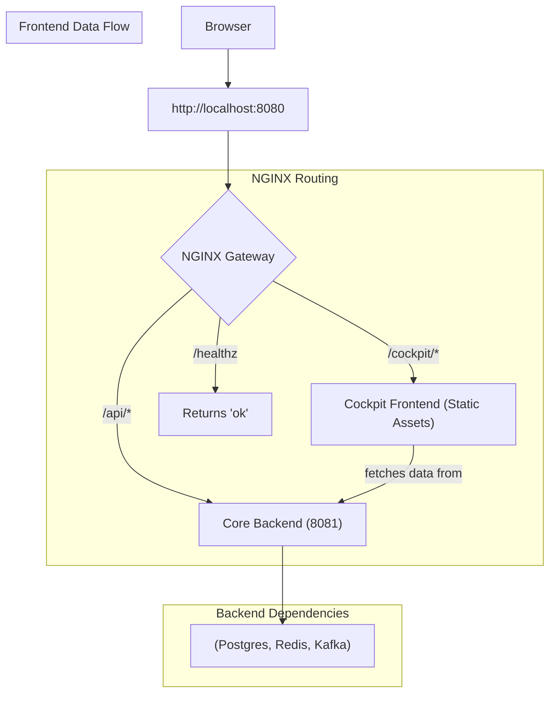

# Gateway Integration — Unified Access Point

> **Goal:** Serve both the React cockpit and Spring Boot backend through a single gateway (`http://localhost:8080`).

---

## ✅ Final URLs

| Service                                | Path        | Example                                                                            |
| -------------------------------------- | ----------- | ---------------------------------------------------------------------------------- |
| Cockpit UI                             | `/cockpit/` | [http://localhost:8080/cockpit/](http://localhost:8080/cockpit/)                   |
| Core Operational Backend (Spring Boot) | `/api/`     | [http://localhost:8080/api/people/B-0002](http://localhost:8080/api/people/B-0002) |
| Health Check                           | `/healthz`  | [http://localhost:8080/healthz](http://localhost:8080/healthz)                     |

---

