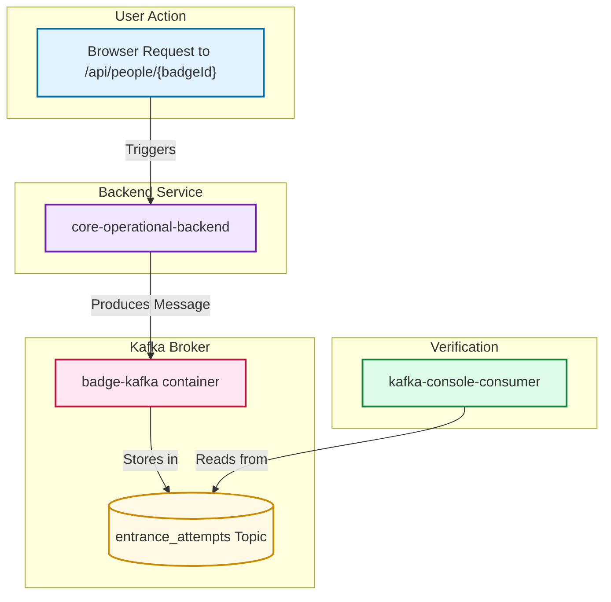

# Kafka in the Badge Entrance Simulation

This document explains the role and implementation of Apache Kafka in this project.

## Purpose

Kafka acts as a high-throughput, durable messaging system for internal service-to-service communication. Its primary role is to log all badge scan attempts, whether they are successful or not. This creates a reliable, chronological "source of truth" that other services can consume for various purposes, such as updating dashboards, performing analytics, or feeding into other systems.

## Data Flow

The data flow for Kafka is straightforward: the `core-operational-backend` acts as a **Producer**, sending event records to the `badge-kafka` **Broker**, which stores them in the `entrance_attempts` **Topic**.



---

## Producer Implementation (`core-operational-backend`)

To send messages to Kafka, the `core-operational-backend` service is configured as a Kafka Producer.

### 1. Dependencies (`pom.xml`)

The `spring-kafka` dependency is included to provide Spring Boot integration with Kafka.

```xml
<dependency>
    <groupId>org.springframework.kafka</groupId>
    <artifactId>spring-kafka</artifactId>
</dependency>
```

### 2. Configuration (`application.properties`)

This file tells the service how to find and communicate with the Kafka broker.

```properties
# --- Kafka ---
# The address of the Kafka broker inside the Docker network
spring.kafka.bootstrap-servers=kafka:9092

# How to convert the message key and value to bytes for sending
spring.kafka.producer.key-serializer=org.apache.kafka.common.serialization.StringSerializer
spring.kafka.producer.value-serializer=org.apache.kafka.common.serialization.StringSerializer

# For development, allow Spring to auto-create topics if they don't exist
spring.kafka.admin.auto-create=true
```

### 3. Producer and Template Configuration (`KafkaProducerConfig.java`)

This class creates the `KafkaTemplate`, a helper provided by Spring that simplifies the process of sending messages.

```java
package upec.badge.core_operational_backend.config;

import org.apache.kafka.clients.producer.ProducerConfig;
import org.apache.kafka.common.serialization.StringSerializer;
import org.springframework.context.annotation.Bean;
import org.springframework.context.annotation.Configuration;
import org.springframework.kafka.core.DefaultKafkaProducerFactory;
import org.springframework.kafka.core.KafkaTemplate;
import org.springframework.kafka.core.ProducerFactory;

import java.util.HashMap;
import java.util.Map;

@Configuration
public class KafkaProducerConfig {

    @Bean
    public ProducerFactory<String, String> producerFactory() {
        Map<String, Object> config = new HashMap<>();
        config.put(ProducerConfig.BOOTSTRAP_SERVERS_CONFIG, "kafka:9092");
        config.put(ProducerConfig.KEY_SERIALIZER_CLASS_CONFIG, StringSerializer.class);
        config.put(ProducerConfig.VALUE_SERIALIZER_CLASS_CONFIG, StringSerializer.class);
        return new DefaultKafkaProducerFactory<>(config);
    }

    @Bean
    public KafkaTemplate<String, String> kafkaTemplate() {
        return new KafkaTemplate<>(producerFactory());
    }
}
```

### 4. Sending the Message (`EventProducer.java`)

This service uses the `KafkaTemplate` to build and send the final message to the `entrance_attempts` topic.

```java
package upec.badge.core_operational_backend.service;

import org.slf4j.Logger;
import org.slf4j.LoggerFactory;
import org.springframework.kafka.core.KafkaTemplate;
import org.springframework.stereotype.Service;
import java.time.Instant;

@Service
public class EventProducer {

    private static final Logger log = LoggerFactory.getLogger(EventProducer.class);
    private final KafkaTemplate<String, String> kafkaTemplate;

    public EventProducer(KafkaTemplate<String, String> kafkaTemplate) {
        this.kafkaTemplate = kafkaTemplate;
    }

    public void publishBadgeEvent(String badgeId, boolean granted) {
        String topic = "entrance_attempts";
        String status = granted ? "GRANTED" : "DENIED";
        String message = String.format(
                "{\"badge_id\":\"%s\",\"status\":\"%s\",\"timestamp\":\"%s\"}",
                badgeId, status, Instant.now().toString()
        );
        kafkaTemplate.send(topic, badgeId, message);
        log.info("Sent event to Kafka -> {}", message);
    }
}
```

---

## Broker Configuration (`docker-compose.yml`)

The Kafka broker itself is defined as a service in our `docker-compose.yml` file, along with its required dependency, Zookeeper.

```yaml
  zookeeper:
    image: confluentinc/cp-zookeeper:7.5.0
    container_name: badge-zookeeper
    environment:
      ZOOKEEPER_CLIENT_PORT: 2181
      ZOOKEEPER_TICK_TIME: 2000

  kafka:
    image: confluentinc/cp-kafka:7.5.0
    container_name: badge-kafka
    depends_on:
      - zookeeper
    environment:
      KAFKA_BROKER_ID: 1
      KAFKA_ZOOKEEPER_CONNECT: zookeeper:2181
      KAFKA_ADVERTISED_LISTENERS: PLAINTEXT://kafka:9092
      KAFKA_OFFSETS_TOPIC_REPLICATION_FACTOR: 1
```

---

## Verification

We verified that the entire flow was working by using the `kafka-console-consumer` tool, which is included in the `badge-kafka` container.

### Command

This command starts a consumer that listens to the `entrance_attempts` topic from the very beginning and prints any messages it finds.

```bash
docker exec badge-kafka kafka-console-consumer --bootstrap-server localhost:9092 --topic entrance_attempts --from-beginning
```

### Example Output

After running the consumer and accessing the API endpoint, we saw the following message in the terminal, confirming the setup was successful:

```json
{"badge_id":"B-0001","status":"GRANTED","timestamp":"2025-11-07T21:09:57.838821178Z"}
```
