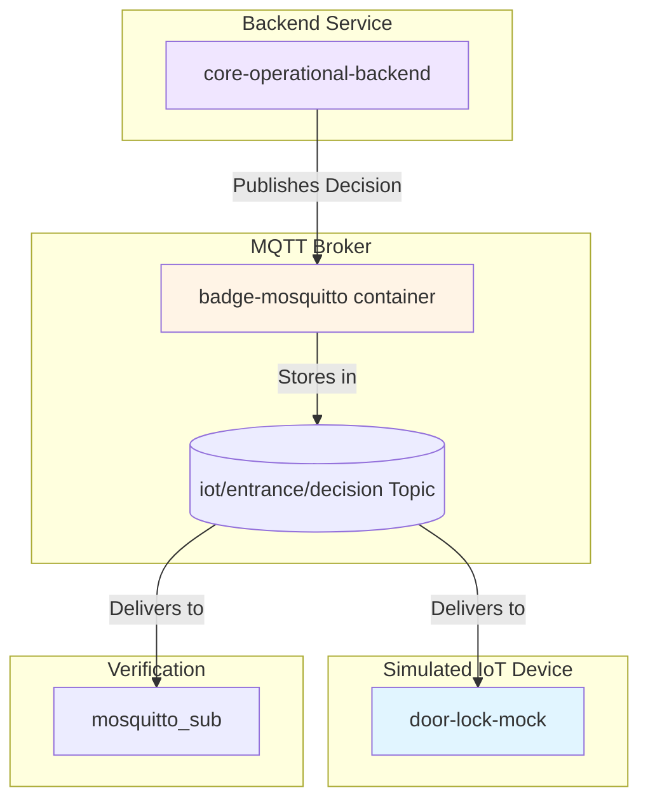

# MQTT in the Badge Entrance Simulation

This document explains the role and implementation of MQTT in this project.

## Purpose

MQTT (Message Queuing Telemetry Transport) is a lightweight messaging protocol designed for constrained devices and low-bandwidth, high-latency networks. It is ideal for Internet of Things (IoT) scenarios.

In our project, MQTT's role is to handle the real-time communication between our backend services and the simulated IoT devices (the badge reader and the door lock). Specifically, it is used to publish the final "GRANTED" or "DENIED" decision so that the simulated door lock can react instantly.

## Data Flow

The `core-operational-backend` acts as an MQTT **Publisher**. After it validates a badge against the database, it publishes a decision message to the `iot/entrance/decision` **Topic** on the `badge-mosquitto` **Broker**. A simulated `door-lock-mock` service (to be built later) will act as a **Subscriber** to this topic.



---

## Publisher Implementation (`core-operational-backend`)

To send messages to the Mosquitto broker, the `core-operational-backend` service is configured as an MQTT Publisher using Spring Integration.

### 1. Dependencies (`pom.xml`)

We added two dependencies: `spring-integration-mqtt` provides the high-level Spring integration, and `org.eclipse.paho.client.mqttv3` is the underlying MQTT client library that handles the communication.

```xml
<dependency>
    <groupId>org.springframework.integration</groupId>
    <artifactId>spring-integration-mqtt</artifactId>
</dependency>

<dependency>
    <groupId>org.eclipse.paho</groupId>
    <artifactId>org.eclipse.paho.client.mqttv3</artifactId>
    <version>1.2.5</version>
</dependency>
```

### 2. MQTT Configuration (`MqttConfig.java`)

This configuration class sets up the connection to the broker and defines the channel for sending outbound messages.

```java
package upec.badge.core_operational_backend.config;

import org.eclipse.paho.client.mqttv3.MqttConnectOptions;
import org.springframework.context.annotation.Bean;
import org.springframework.context.annotation.Configuration;
import org.springframework.integration.annotation.ServiceActivator;
import org.springframework.integration.channel.DirectChannel;
import org.springframework.integration.mqtt.core.DefaultMqttPahoClientFactory;
import org.springframework.integration.mqtt.core.MqttPahoClientFactory;
import org.springframework.integration.mqtt.outbound.MqttPahoMessageHandler;
import org.springframework.messaging.MessageChannel;
import org.springframework.messaging.MessageHandler;

@Configuration
public class MqttConfig {

    // 1. Configure the connection to the broker (tcp://mosquitto:1883)
    @Bean
    public MqttPahoClientFactory mqttClientFactory() {
        DefaultMqttPahoClientFactory factory = new DefaultMqttPahoClientFactory();
        MqttConnectOptions options = new MqttConnectOptions();
        options.setServerURIs(new String[] { "tcp://mosquitto:1883" });
        options.setCleanSession(true);
        factory.setConnectionOptions(options);
        return factory;
    }

    // 2. Create a message handler that sends messages to the default topic
    @Bean
    @ServiceActivator(inputChannel = "mqttOutboundChannel")
    public MessageHandler mqttOutbound(MqttPahoClientFactory mqttClientFactory) {
        MqttPahoMessageHandler messageHandler = new MqttPahoMessageHandler("coreOperationalBackendClientId", mqttClientFactory);
        messageHandler.setAsync(true);
        messageHandler.setDefaultTopic("iot/entrance/decision");
        return messageHandler;
    }

    // 3. Define the channel that our code will use to send messages
    @Bean
    public MessageChannel mqttOutboundChannel() {
        return new DirectChannel();
    }
}
```

### 3. Sending the Message (`MqttDecisionPublisher.java`)

This service provides a simple method to send a decision message to the `mqttOutboundChannel` we defined in the configuration.

```java
package upec.badge.core_operational_backend.service;

import org.slf4j.Logger;
import org.slf4j.LoggerFactory;
import org.springframework.integration.support.MessageBuilder;
import org.springframework.messaging.MessageChannel;
import org.springframework.stereotype.Service;

@Service
public class MqttDecisionPublisher {

    private static final Logger log = LoggerFactory.getLogger(MqttDecisionPublisher.class);
    private final MessageChannel mqttOutboundChannel;

    public MqttDecisionPublisher(MessageChannel mqttOutboundChannel) {
        this.mqttOutboundChannel = mqttOutboundChannel;
    }

    public void publishDecision(String badgeId, boolean granted) {
        String status = granted ? "GRANTED" : "DENIED";
        String message = String.format(
                "{\"badge_id\":\"%s\",\"status\":\"%s\"}",
                badgeId, status
        );
        mqttOutboundChannel.send(MessageBuilder.withPayload(message).build());
        log.info("Sent MQTT decision -> {}", message);
    }
}
```

This service is then injected into the `PeopleController` and called after a badge is validated.

---

## Broker Configuration (`docker-compose.yml`)

The Mosquitto MQTT broker is defined as a service in our `docker-compose.yml` file.

```yaml
  mosquitto:
    image: eclipse-mosquitto:2
    container_name: badge-mosquitto
    ports:
      - "1883:1883"
    volumes:
      - ./mosquitto/config/mosquitto.conf:/mosquitto/config/mosquitto.conf:ro
```

---

## Verification

We can verify that the flow is working by using the `mosquitto_sub` command-line tool, which is included in the `badge-mosquitto` container.

### Command

This command starts a subscriber that listens to the `iot/entrance/decision` topic.

```bash
docker exec badge-mosquitto mosquitto_sub -h localhost -t iot/entrance/decision
```

### Expected Output

After running the subscriber and accessing the API endpoint, we expect to see a JSON message in the terminal, like this:

```json
{"badge_id":"B-0001","status":"GRANTED"}
```

